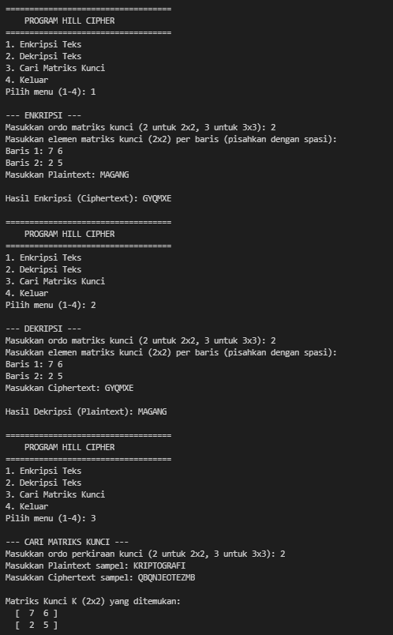

# Hill Cipher Python Implementation

**Muhammad Razky Nur - 140810240035**

---

## Alur Program

1. **Pilihan 1: Enkripsi Teks**
   Ketika program dijalankan dan pengguna memilih menu enkripsi, alurnya adalah sebagai berikut:
   - **a)** Pengguna memasukkan angka untuk menentukan ordo matriks kunci (contoh: 2 untuk 2x2, atau 3 untuk 3x3).
   - **b)** Pengguna memasukkan nilai elemen matriks kunci baris demi baris (tiap angka dipisahkan dengan spasi).
   - **c)** Pengguna memasukkan *Plaintext* (teks asli) yang ingin disandikan.
   - **d)** Program memvalidasi kunci (mengecek determinan) dan memproses teks.
   - **e)** Menampilkan hasil akhir berupa teks sandi (*Ciphertext*).

2. **Pilihan 2: Dekripsi Teks**
   Ketika pengguna memilih menu dekripsi untuk mengembalikan teks sandi menjadi teks asli, alurnya:
   - **a)** Pengguna memasukkan ordo matriks kunci yang digunakan.
   - **b)** Pengguna memasukkan elemen matriks kuncinya baris demi baris.
   - **c)** Pengguna memasukkan *Ciphertext* yang ingin dibongkar.
   - **d)** Program akan mencari invers dari matriks kunci tersebut dan melakukan perkalian matriks dengan teks.
   - **e)** Menampilkan hasil akhir berupa teks asli (*Plaintext*).

3. **Pilihan 3: Cari Matriks Kunci**
   Jika pengguna ingin mencari tahu kunci (matriks) yang digunakan dari teks yang sudah ada:
   - **a)** Pengguna memasukkan perkiraan ordo matriks kunci.
   - **b)** Pengguna memasukkan sampel *Plaintext* yang diketahui.
   - **c)** Pengguna memasukkan sampel *Ciphertext* pasangannya.
   - **d)** Program akan memecah teks menjadi blok-blok matriks, mencari determinan yang valid (koprima dengan 26), dan menghitung inversnya.
   - **e)** Menampilkan matriks kunci yang berhasil ditemukan.

4. **Pilihan 4: Keluar**
   Program akan menampilkan pesan penutup dan menghentikan eksekusi. Jika pengguna memasukkan pilihan di luar 1-4, program akan meminta input ulang.

---

## Hasil Running Program

