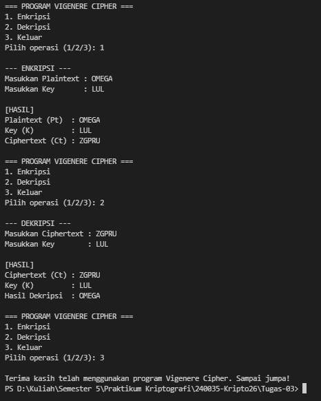

# Vigenere Cipher Python Implementation

**Muhammad Razky Nur - 140810240035**

---

## Alur Program

1. **Pilihan 1: Enkripsi Teks**
   Ketika program dijalankan dan pengguna memilih menu enkripsi, alurnya adalah sebagai berikut:
   - **a)** Pengguna memasukkan *Plaintext* (teks asli) yang ingin disandikan.
   - **b)** Pengguna memasukkan *Key* (kata kunci) yang digunakan sebagai basis pergeseran.
   - **c)** Program memperpanjang *Key* secara berulang (*extend key*) agar panjangnya setara dengan *Plaintext*.
   - **d)** Program mengonversi setiap huruf ke nilai numerik ($A=0$ sampai $Z=25$) dan mengalkulasikannya menggunakan rumus $E(x) = (x + K) \bmod 26$.
   - **e)** Menampilkan hasil akhir berupa teks sandi (*Ciphertext*).

2. **Pilihan 2: Dekripsi Teks**
   Ketika pengguna memilih menu dekripsi untuk mengembalikan teks sandi menjadi teks asli, alurnya:
   - **a)** Pengguna memasukkan *Ciphertext* (teks sandi) yang akan dibongkar.
   - **b)** Pengguna memasukkan *Key* (kata kunci) pasangannya.
   - **c)** Program memperpanjang *Key* agar panjangnya setara dengan *Ciphertext*.
   - **d)** Program mengonversi huruf ke numerik ($0-25$) dan menghitung kembaliannya menggunakan rumus $D(x) = (x - K) \bmod 26$.
   - **e)** Menampilkan hasil akhir berupa teks asli (*Plaintext*).

3. **Pilihan 3: Keluar**
   - Program akan menampilkan pesan penutup dan menghentikan eksekusi perulangan (*looping*). Jika pengguna memasukkan opsi di luar 1–3, program akan menampilkan peringatan dan meminta input ulang.

---

## Hasil Running Program

