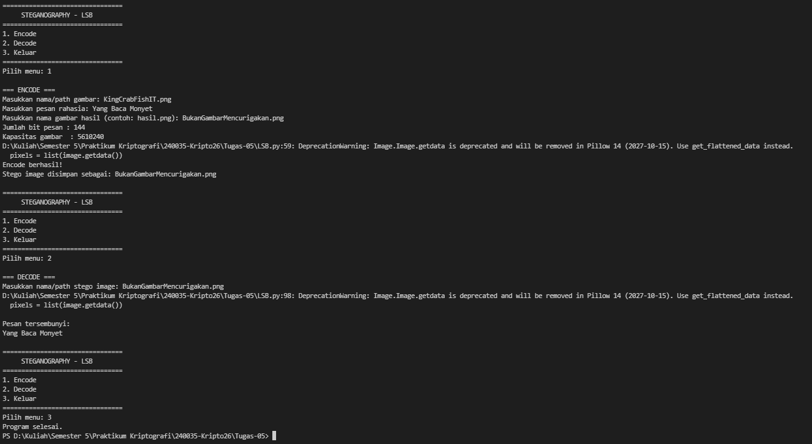

# LSB Steganography Python Implementation

**MUHAMMAD RAZKY NUR - 140810240035**

---

## Alur Program

Program ini menggunakan metode **Least Significant Bit (LSB)** untuk menyembunyikan pesan rahasia ke dalam gambar BMP 24-bit. Pesan disisipkan dengan mengubah bit paling rendah (*Least Significant Bit*) dari setiap komponen warna RGB pada pixel gambar. Perubahan pada LSB hanya menghasilkan perubahan nilai byte yang sangat kecil sehingga perubahan pada gambar sulit terlihat secara visual.

### 1. Pilihan 1: Encode

Ketika pengguna memilih menu **Encode**, program akan menyisipkan pesan rahasia ke dalam gambar. Alurnya adalah sebagai berikut:

- **a)** Pengguna memasukkan nama atau lokasi file gambar **BMP 24-bit** yang akan digunakan sebagai *cover image*.
- **b)** Pengguna memasukkan pesan rahasia yang ingin disembunyikan.
- **c)** Program mengubah setiap karakter pada pesan menjadi bentuk **binary 8-bit**.
- **d)** Program menghitung panjang pesan dan menyimpannya dalam bentuk **32-bit** sebagai penanda agar pesan dapat diketahui saat proses *decode*.
- **e)** Program menggabungkan informasi panjang pesan dengan binary pesan menjadi data yang akan disisipkan.
- **f)** Program membaca pixel gambar yang terdiri dari komponen warna **RGB**. Pada citra *true color*, satu pixel terdiri dari 24 bit yang dibentuk oleh komponen RGB.
- **g)** Program mengganti bit paling rendah (*LSB*) dari setiap komponen RGB dengan bit pesan secara berurutan.
- **h)** Setelah seluruh data pesan berhasil disisipkan, program menyimpan gambar baru sebagai **stegano image**.
- **i)** Program menampilkan informasi bahwa proses *encode* berhasil dan nama file hasil.

Konsep penyisipan bit pada LSB mengikuti contoh pada materi, yaitu bit pesan dimasukkan ke bit terakhir dari nilai RGB pada pixel gambar.

### 2. Pilihan 2: Decode

Ketika pengguna memilih menu **Decode**, program akan mengambil kembali pesan yang telah disembunyikan dari *stegano image*. Alurnya adalah sebagai berikut:

- **a)** Pengguna memasukkan nama atau lokasi file **stegano BMP** yang sebelumnya telah digunakan pada proses *encode*.
- **b)** Program membaca data pixel dari gambar.
- **c)** Program mengambil **LSB** dari setiap komponen RGB secara berurutan.
- **d)** Program membaca 32 bit pertama untuk mengetahui panjang pesan yang disembunyikan.
- **e)** Program mengambil binary pesan berdasarkan panjang pesan tersebut.
- **f)** Program mengubah setiap kelompok 8 bit binary kembali menjadi karakter.
- **g)** Program menggabungkan seluruh karakter dan menampilkan hasil akhirnya sebagai **pesan rahasia**.

### 3. Pilihan 3: Keluar

- Program akan menampilkan pesan penutup dan menghentikan perulangan (*looping*).
- Jika pengguna memasukkan pilihan selain **1–3**, program akan menampilkan pesan bahwa pilihan tidak tersedia dan meminta pengguna memasukkan pilihan kembali.

---

## Hasil Running Program

### Hasil Stegano Image

